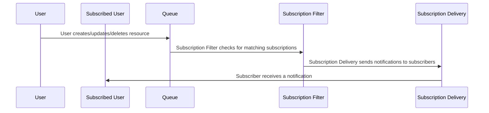

# [RFC] FHIR Subscriptions

## Abstract
FHIR Subscriptions are FHIR resources that define a mechanism for clients to receive notifications about changes to resources that match certain criteria.
This allows clients to stay up-to-date with changes in the server without having to continuously poll for updates.
However, implementing FHIR Subscriptions can be complex and may require significant changes to the server architecture.

## Background
**R4:**
The data model for a FHIR Subscription is defined [here](/docs/reference/fhir/model/resources/Subscription).
This is the `normal` approach for handling in R4.

**R4 Backport:**
With R5, they did a complete redesign and offer a backport to R4. The following is the [implementation guide](https://build.fhir.org/ig/HL7/fhir-subscription-backport-ig/).

The main difference between the R4 Backport and R4 is the backport decouples
subscribers from the subscription resource and instead uses a separate `SubscriptionTopic` resource to define the criteria for notifications.

## Problem
How should we implement FHIR Subscriptions in a way that is efficient, scalable, and maintainable while also adhering to the FHIR specification?

## Proposal

Terminology:
- Queue: Abstract queue that delivers resources
- Subscription Filter: Worker(s) that filter for resources that match a FHIR Subscription's criteria
- Subscription Delivery: Worker(s) that deliver resources to subscribers

## Alternative Solutions `<Optional>`
Describe any alternative solutions that were considered and why they were not chosen.

## Migration Plan `<Optional>`
Describe how the changes will be rolled out and what impact they will have on existing systems.

## Approaches
Detailed approaches to implementing FHIR Subscriptions.

### Postgres based Implementation

### Kafka Based Implementation
#### Notes

Could use `tenant:project:subscription_id` as the message key for Kafka messages to ensure that messages for the same subscription are processed in order.
Could then have multiple consumers that are partitioned by `subscription_id` to ensure that messages for the same subscription are processed in order.
Would also allow consumption for multiple tenants and projects without having to worry about message ordering across tenants and projects.

Implementation would look as follows:

Postgres data sink (WAL or via SQL) -> Kafka main bus `tenant:project` -> Subscription Filter -> Kafka `tenant:project:[subscription_id or topic]` -> Subscription Delivery worker -> Subscriber